# FinTech Module 14 Challenge: Machine Learning Trading Bot

Trading strategy where we try to predict the direction of the future price changing. 
We use Machine Learning Algorithms (Simple Moving Averages) to predict direction of future returns.

### SVM short is 4 and long is 100.

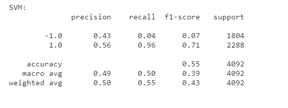
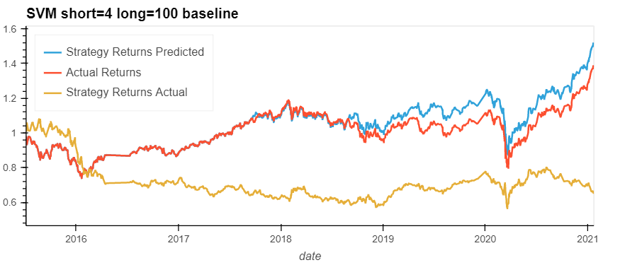
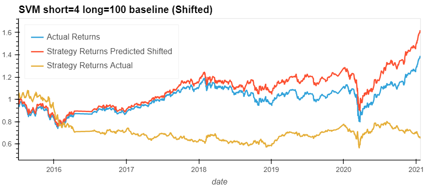

### AdaBoost short is 4 and long is 100.
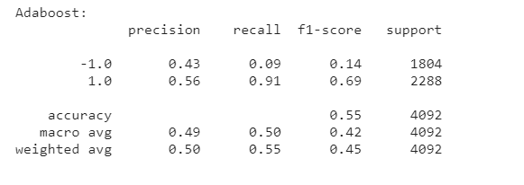
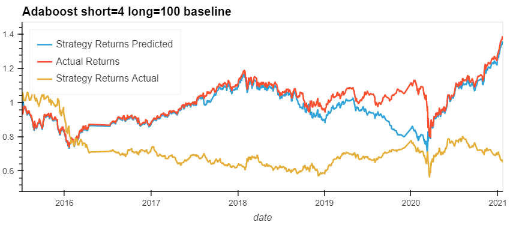
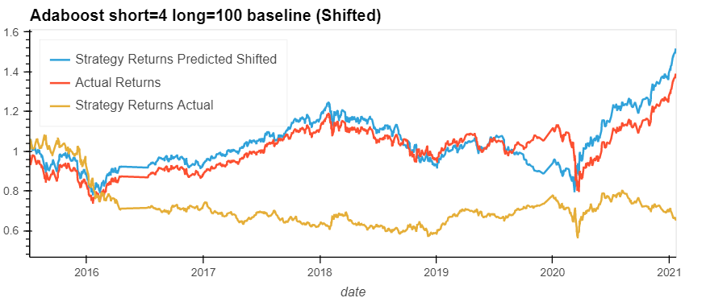

## Increase Training Time period to 2 years (4, 2015 to end of 3, 2017) 

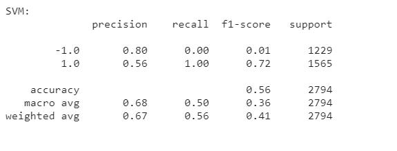
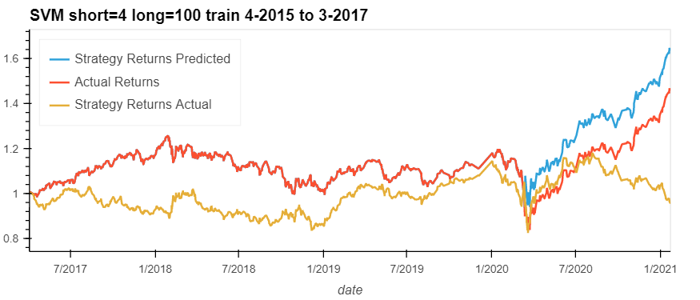
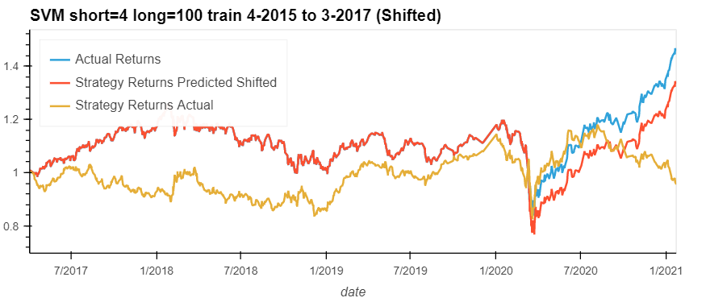

### Adaboost short is 4 and long is 100

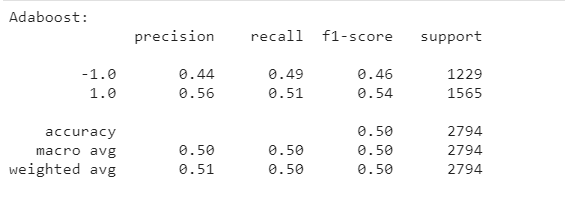
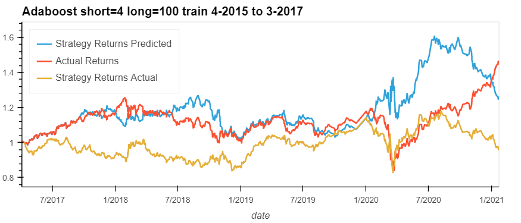
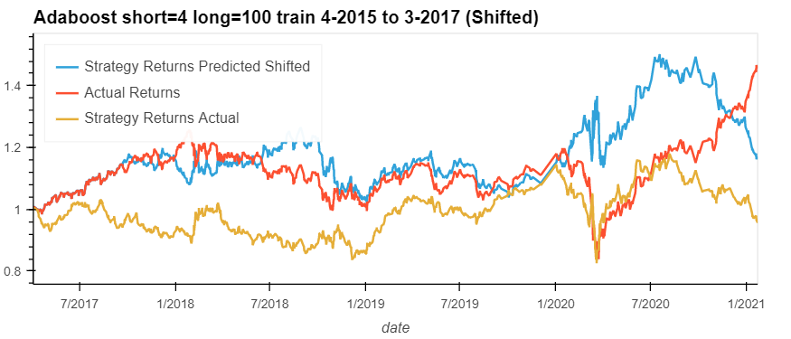

### SVM short is 4 and long is 50

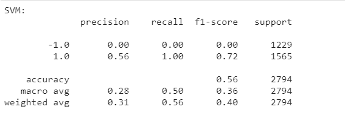
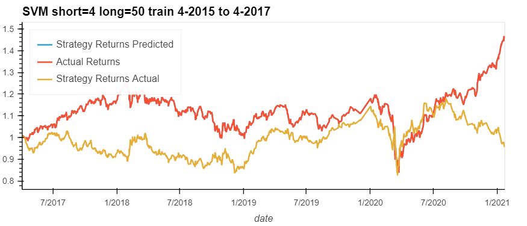
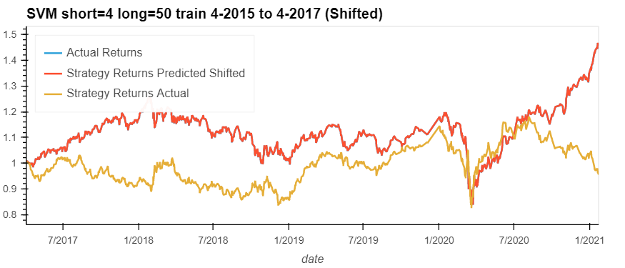

### Adaboost short is 4 and long is 50

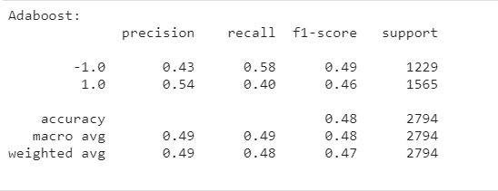
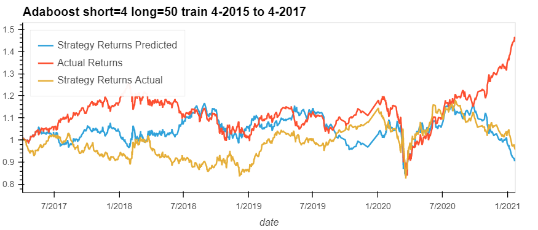
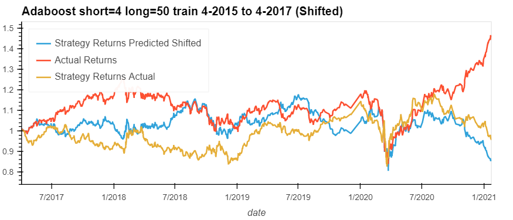

## Test runs 

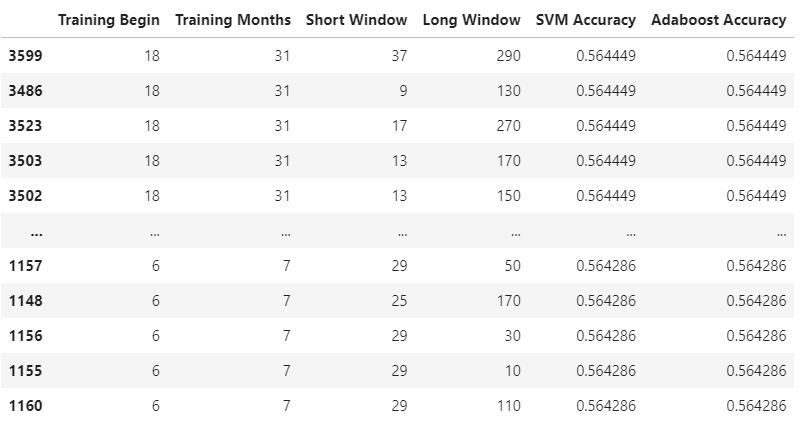
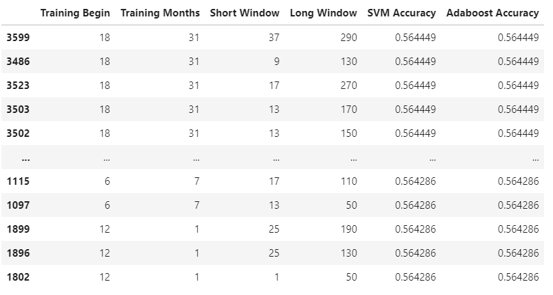

## Summary

The overall best model out of the models explored is the baseline SVM model because it has one of the best overall accuracies and is able to predict some key negative returns resulting in one of the best overall returns. Although, it may not be able to predict all the future downturns and may result in adverse performance because it is pretty bad at predicting negative returns. A baseline Adaboost trained on oversampled positive events may have performed better than the baseline SVM model for the overall returns. Oversampling for the Adaboost needs to be tried out.

---

## Usage

To use the Application, download and open the **machine_learning_trading_bot.ipynb** 

---

## Contributors

Grigory Timofeev

[E-mail](fintech_github_challenge14@unloca.com)

---

## License

The MIT License (MIT)

Copyright (c) 2022 Grigory Timofeev

Permission is hereby granted, free of charge, to any person obtaining a copy of this software and associated documentation files (the "Software"), to deal in the Software without restriction, including without limitation the rights to use, copy, modify, merge, publish, distribute, sublicense, and/or sell copies of the Software, and to permit persons to whom the Software is furnished to do so, subject to the following conditions:

The above copyright notice and this permission notice shall be included in all copies or substantial portions of the Software.

THE SOFTWARE IS PROVIDED "AS IS", WITHOUT WARRANTY OF ANY KIND, EXPRESS OR IMPLIED, INCLUDING BUT NOT LIMITED TO THE WARRANTIES OF MERCHANTABILITY, FITNESS FOR A PARTICULAR PURPOSE AND NONINFRINGEMENT. IN NO EVENT SHALL THE AUTHORS OR COPYRIGHT HOLDERS BE LIABLE FOR ANY CLAIM, DAMAGES OR OTHER LIABILITY, WHETHER IN AN ACTION OF CONTRACT, TORT OR OTHERWISE, ARISING FROM, OUT OF OR IN CONNECTION WITH THE SOFTWARE OR THE USE OR OTHER DEALINGS IN THE SOFTWARE.
